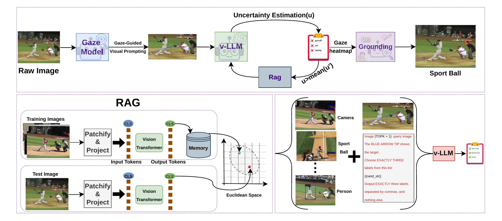

<h2 align="center">From Gaze to Meaning: A Training-Free<br/>AI Agent for Unified Grounding and Explanation</h2>

<p align="center">
  <a href="https://arxiv.org/abs/XXXX.XXXXX"></a>
  <!-- TODO: replace XXXX.XXXXX above with the real arXiv id once assigned -->
  <a href="https://shayan137.github.io/gta-project-page/"></a>
  
</p>

<p align="center"><b>Shayan Nasiriboukani, Sara Atito, Mohammad Nezamipour, Muhammad Awais</b><br/>
Centre for Vision, Speech and Signal Processing (CVSSP), University of Surrey, UK</p>

---

**Gaze Target Agent (GTA)** is the first **training-free** agent for
gaze-guided reasoning: gaze target prediction, attention localization, and object
identification, all from a single pretrained vision-language model. GTA augments a frozen
VLM with **gaze-guided visual prompting**, rescues low-confidence predictions with a
**memory-based (RAG) retrieval** step, and **grounds** the predicted label to a
bounding box. GTA reaches state-of-the-art results on the GazeFollow and GazeHOI benchmarks.

<p align="center">
  
</p>

## 🛠️ Installation
```bash
git clone <this repo>
cd <this repo>
pip install -r requirements.txt
```
Every model (Qwen3-VL, GazeLLE, CLIP, the grounding detector) auto-downloads on first use
into one shared, repo-local folder, `model_cache_dir`, with no manual pre-download step.
Swap a model by editing its name in the config, e.g. `qwen_model: Qwen3-VL-4B-Instruct`.

## 📦 Data Preparation
Download the two benchmarks and point each dataset's `configs/*.yaml` at where you put
them. Each dataset needs the raw images plus two separate annotation files: a head-bbox
file (tells GazeLLE where the head is, config field `annotations_txt` for GazeFollow or
`annotations_csv` for GazeHOI) and a target-object label file (the ground-truth answer
key, `gt_csv` / `eval_csv`), plus `vocab_path` (the valid label list):
- **[GazeFollow](https://huggingface.co/datasets/vikhyatk/gazefollow)**: raw images,
  head-bbox annotations, and target-object labels.
- **[GazeHOI](https://github.com/idiap/semgaze)**: raw images, head and object-bbox
  annotations, and the object label files for both datasets.

## 🔨 Usage
```bash
python scripts/build_cls_embeddings.py --config configs/gazefollow.yaml   # one-time, per dataset
python scripts/run_agent.py --config configs/gazefollow.yaml
```
One per-sample pass, with no separate stages: GazeLLE gaze prediction, then visual
prompt, then Qwen3-VL top-3, then retrieval rescue if uncertain, before moving to the
next image.

For GazeHOI, the same pass adds a grounding step, localizing the prediction to a
bounding box:
```bash
python scripts/build_cls_embeddings.py --config configs/gazehoi.yaml
python scripts/run_gazehoi_agent.py --config configs/gazehoi.yaml
```

## 🗂️ Code Structure
```
source/
  agent.py                 # GazeTargetAgent.run(): predict -> check -> retrieve
  config.py                # YAML config dataclasses
  prompts.py                # prompt templates
  threshold.py               # uncertainty threshold policy
  uncertainty.py              # confidence scoring from generation output
  visual_arrow.py              # gaze-guided visual prompting (arrow/dot/heatmap)
  data/
    dataset.py                    # per-dataset item loaders
    gazefollow_annotations.py     # GazeFollow head-bbox parsing
    gazehoi_annotations.py        # GazeHOI head/object-bbox + label lookup
    vocab.py                      # target-object vocabulary
    io_utils.py, text_utils.py
  models/
    model.py                 # Qwen3-VL wrapper
    gazelle.py                # gaze estimation
    retrieval.py               # CLIP CLS retrieval (RAG rescue)
    grounding.py                # detector + gaze-guided selection + scoring (GazeHOI)
scripts/
  build_cls_embeddings.py  # one-time per dataset: CLIP embeddings for training images
  run_agent.py              # GazeFollow entrypoint
  run_gazehoi_agent.py       # GazeHOI entrypoint (adds grounding)
  reground.py                # re-score grounding without re-running the VLM
configs/
  gazefollow.yaml, gazehoi.yaml  # one config per dataset
```


## 📑 Citation
```bibtex
@inproceedings{nasiriboukani2026gaze,
  title     = {From Gaze to Meaning: A Training-Free AI Agent for Unified Grounding and Explanation},
  author    = {Nasiriboukani, Shayan and Atito, Sara and Nezamipour, Mohammad and Awais, Muhammad},
  booktitle = {European Conference on Computer Vision (ECCV)},
  year      = {2026}
}
```
